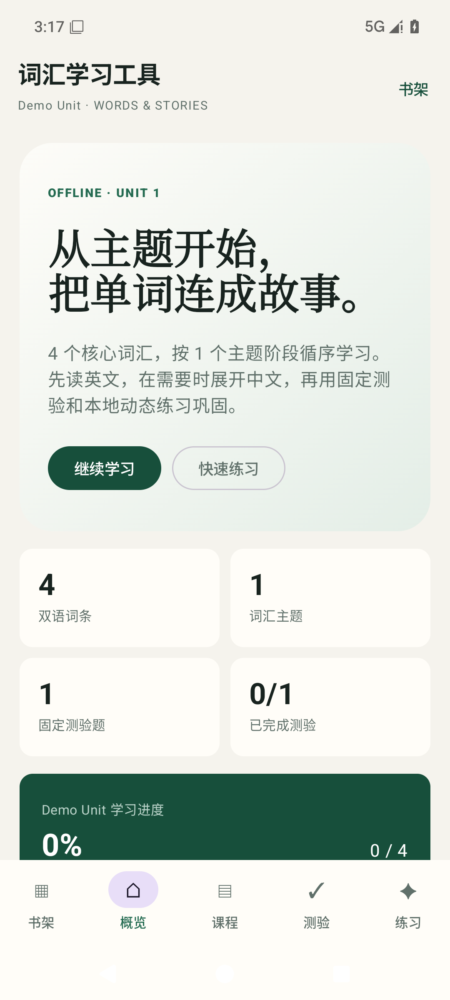
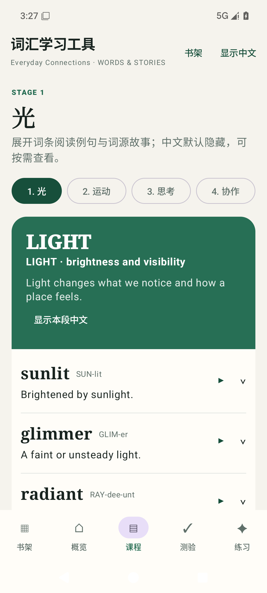
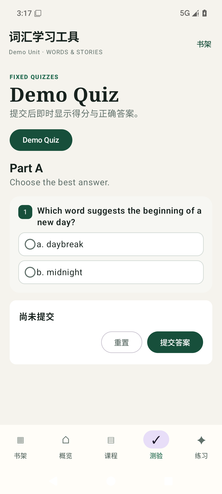

# Vocabulary Builder Clean · 纯净词汇学习工具

[中文](#中文) · [English](#english)

[](https://github.com/Page67/vocabularybuilder_clean/actions/workflows/android.yml)
[](https://github.com/Page67/vocabularybuilder_clean/releases)

<p align="center">
  
  
  
</p>

<p align="center">
  <a href="https://github.com/Page67/vocabularybuilder_clean/releases/download/v1.0.0/full-apk-showcase-18s.mp4">▶ 观看完整私用版的 18 秒界面演示 / Watch the 18-second full private-build showcase</a>
</p>

> 视频仅用于展示完整私用版的界面与交互。完整 APK、教材内容和中间文件均不在本仓库中。
>
> The video demonstrates the interface and interaction of the complete private build. The full APK,
> textbook content, and intermediate artifacts are not included in this repository.

## 中文

这是一个使用 Kotlin 和 Jetpack Compose 构建的离线优先 Android 词汇学习框架。

本公开仓库不包含任何教材正文、翻译、扫描件、来源映射、提取结果、审核记录、生产
APK 或其他中间文件。仓库自带的单单元数据全部为原创演示内容，只用于确保克隆后
项目能够直接运行。完整示范单元包含 5 个课程阶段、15 个双语词条、5 个阶段测验和
1 个综合复习测验，可体验应用的主要学习流程。

### Vibe Coding 开发方式

本项目采用 **Vibe Coding（氛围编程）**：由用户确定产品目标、内容标准、版权与分发边界
并作出最终验收决定，AI 编程 Agent 协助实现、测试、审查和记录。它并非无约束的提示词生成，
而是结合人工复核、明确交付门禁、隔离工作树、确定性验证、串行推广、设备测试和失败即关闭
审计，使工程过程保持可追溯和可复现。

### 功能

- 书架、主题课程、按需显示中文、固定测验和本地动态练习。
- 三句写作练习、Android 系统文字转语音和设备本地学习进度。
- 数据驱动的目录与单元 JSON，方便替换成你有权使用的内容。
- 无账号、无分析、无广告、无云同步，且不申请网络权限。
- 独立安装包 ID `com.page67.vocabularybuilder.clean`，不会覆盖私用版本。

### 构建

需要 JDK 17，以及与 `gradle/libs.versions.toml` 中声明版本相符的 Android SDK。

```powershell
.\gradlew.bat :app:testDebugUnitTest :app:lintDebug --no-daemon
.\gradlew.bat :app:assembleDebug --no-daemon
```

macOS 或 Linux 请使用 `./gradlew`。

每次推送后，GitHub Actions 会生成一个可安装的 debug APK 作为临时构建产物。正式版本
使用独立签名并发布到 [GitHub Releases](https://github.com/Page67/vocabularybuilder_clean/releases)；
仓库不保存 APK 或签名密钥。维护者发布步骤见 [`docs/RELEASING.md`](docs/RELEASING.md)。

### 使用自己的内容

`content/catalog.json` 是内容目录，每个 `payload_path` 指向 `content/units/` 下的一个
单元 JSON。更新内容时请保持稳定 ID，这样本地学习进度仍能对应原来的单元和词条。

只应添加由你原创、属于公有领域，或你已取得复制和分发许可的材料。请勿提交来源
书籍或提取、转换、审核过程中产生的中间文件。

### 许可证

本仓库源码及原创演示数据采用 [MIT License](LICENSE)。第三方 Android 与 Gradle 依赖
仍适用各自的许可证。

## English

An offline-first Android vocabulary-learning shell built with Kotlin and Jetpack Compose.

This public repository contains no textbook text, translation, scan, source map, extraction
output, review record, production APK, or other intermediate artifact. Its bundled single-unit
dataset is newly written demonstration content included only to keep the project runnable after
cloning. The complete demo unit includes five lesson stages, 15 bilingual entries, five stage
quizzes, and one cumulative review quiz, covering the application's main learning flow.

### Vibe Coding development approach

This project was developed through **Vibe Coding**: the user set the product intent, content
standards, copyright and distribution boundaries, and final acceptance decisions, while AI coding
agents assisted with implementation, testing, inspection, and documentation. This was not
unconstrained prompt-to-code generation. Human review, explicit delivery gates, isolated worktrees,
deterministic validation, serialized promotion, device testing, and fail-closed audits kept the
engineering process traceable and reproducible.

### Features

- Bookshelf navigation, topic-based lessons, on-demand Chinese reveal, fixed quizzes, and local
  dynamic practice.
- A three-sentence writing workshop, Android system text-to-speech, and device-local progress.
- A data-driven catalog and unit JSON format that can be replaced with content you may use.
- No accounts, analytics, advertising, cloud sync, or Internet permission.
- A separate application ID, `com.page67.vocabularybuilder.clean`, so it cannot replace a private build.

### Build

The project requires JDK 17 and an Android SDK matching the versions declared in
`gradle/libs.versions.toml`.

```powershell
.\gradlew.bat :app:testDebugUnitTest :app:lintDebug --no-daemon
.\gradlew.bat :app:assembleDebug --no-daemon
```

Use `./gradlew` on macOS or Linux.

Every push produces an installable debug APK as a temporary GitHub Actions artifact. Officially
signed builds are distributed through [GitHub Releases](https://github.com/Page67/vocabularybuilder_clean/releases);
neither APKs nor signing keys are committed. Maintainers can follow
[`docs/RELEASING.md`](docs/RELEASING.md).

### Bring your own content

`content/catalog.json` is the packaged content catalog. Each `payload_path` points to a unit JSON
file under `content/units/`. Preserve stable IDs when updating content so local progress remains
associated with the same units and words.

Only add material that you created, that is in the public domain, or that you have permission to
copy and distribute. Do not commit source books or intermediate extraction, conversion, or review
artifacts.

### License

The source code and original demonstration data are available under the [MIT License](LICENSE).
Third-party Android and Gradle dependencies retain their own licenses.
