# 从书页到掌上学习系统

## “词根词汇训练”完整私有 Android APK 终局技术报告

> **A final engineering report on the complete offline bilingual vocabulary-learning APK**
> 私有技术档案 · 2026 年 8 月 · 仅限本地评审

---

## English Abstract

This report presents the complete engineering story of *Vocabulary Root Training*, a private, offline-first Android APK that transforms a thirty-unit bilingual vocabulary corpus into a coherent learning system. The result is not a document viewer and not a thin mobile wrapper. It is a structured educational product integrating a local library, staged root-based courses, bilingual progressive disclosure, fixed source-aligned quizzes, locally generated practice, system text-to-speech, persistent per-unit progress, and a sentence workshop that combines explainable on-device checks with an optional user-controlled handoff to an external AI application.

The production content comprises thirty continuous approved units, 1,200 vocabulary entries, 180 fixed and review quiz groups, and 3,220 questions. English content is reconstructed from the preferred structured source and cross-checked against page-oriented references; Chinese content is visually reviewed page by page rather than accepted from raw OCR. The content pipeline uses deterministic builders, stable identifiers, source maps, schema and semantic validation, isolated candidates, bounded concurrency, exclusive Android verification, serial production promotion, and fail-closed recovery.

The project demonstrates a broader lesson for agentic software engineering: model capability alone does not create trustworthy delivery. Trust emerges from explicit authorization, evidence-bound claims, human editorial judgment, deterministic artifacts, controlled concurrency, reproducible tests, and the discipline to stop when evidence is incomplete. The APK is therefore both a learning application and a case study in building an auditable human–agent production system.

---

## 目录

1. 执行摘要
2. 项目使命与设计原则
3. 最终产品全貌
4. 学习体验与交互闭环
5. 系统架构与本地状态
6. 内容工程与双语校核
7. 从 Unit 1 到 Unit 30 的工程演进
8. 自动化门禁、并发与串行推广
9. 测试金字塔与 APK 审计
10. 失败、恢复与关键教训
11. 成果、限制与维护建议
12. 对现行 Agentic Coding 的思考
13. 结语

---

# 1. 执行摘要

“词根词汇训练”是一款私人自用、可侧载、完全离线运行的 Android 英语词汇学习应用。它将三十个单元的英文词根、核心词汇、音标、释义、例句、词源故事、固定测验和中文学习内容，重构为一个适合手机阅读、练习、测试与持续复习的系统。

项目最后形成的不是一本被缩小到屏幕里的电子书，而是一套完整的学习基础设施：

- 30 个连续、完整、经过审核的单元；
- 1,200 个双语词条，每单元 40 词；
- 180 组固定与复习测验，共 3,220 道题；
- 每单元五个数据驱动课程阶段；
- 单元书架、学习进度、最后访问单元恢复；
- 英文优先、中文按段或按词展开；
- 系统 TTS 发音；
- 固定测验的单选、复选、即时计分与错误反馈；
- 释义识别、拼写、词根分类、例句填空四类本地动态练习；
- 三句写作工坊、透明的本机机械检查，以及用户主动控制的外部 AI 深入评审交接。

应用不需要账户，不包含分析、广告、云同步或运行时内容下载。学习内容与进度留在设备本地；写作工坊也不会自行连接外部 AI 服务。

## 1.1 数字概览

| 维度 | 完整成品 |
| --- | ---: |
| 单元 | 30 |
| 双语词条 | 1,200 |
| 词根组 | 254 |
| 主题词汇组 | 23 |
| 固定与复习测验组 | 180 |
| 固定题目 | 3,220 |
| 每单元课程阶段 | 5 |
| 最低系统 | Android 8 |
| 最终设备回归 | 5/5 通过 |
| 最终内容与工具回归 | 193 项通过 |

## 1.2 产品全貌

| 完整本地书架 | 书架尾端：Unit 27–30 |
| --- | --- |
| 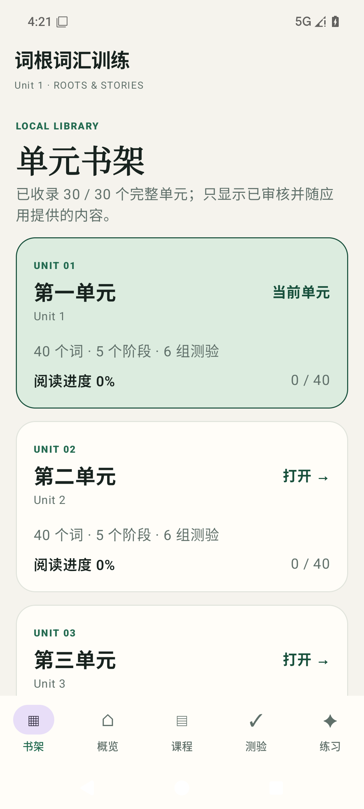 | 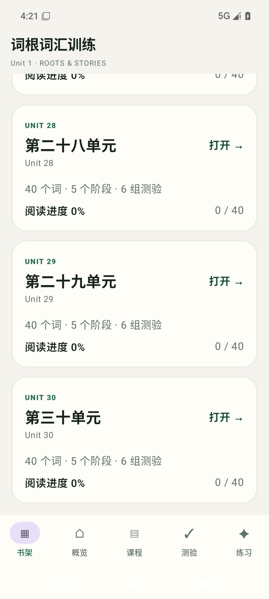 |
| **图 1**　30/30 个完整单元只显示已审核、可用的真实内容。 | **图 2**　滚动到底仍保持连续编号，没有空卡片、占位单元或断裂目录。 |

这两张图定义了项目最终完成的含义：不是“批处理脚本运行结束”，而是学习者能从 Unit 1 无缝抵达 Unit 30，并且每个入口背后都有完整内容、测验与状态空间。

---

# 2. 项目使命与设计原则

## 2.1 最初问题

项目始于一个看似简单的问题：大量书籍信息最适合用什么格式处理？答案指向 EPUB，因为它保留 XHTML 结构；但真正进入工程后发现，任何单一来源都不足以构成完整真相：

- EPUB 适合重建结构化英文；
- 英文 PDF 适合核对页面边界、题目和答案；
- 双语 PDF 承载中文，但存在断字、遗漏、误译与排版异常；
- 原始 OCR 只能帮助定位，不能直接成为最终中文。

由此，项目使命被重新定义为：**不是提取文本，而是建立一条从异构来源到可信移动学习产品的证据链。**

## 2.2 六项设计原则

1. **Offline-first**：内容、评分与状态均能在无网络条件下运行。
2. **English first, Chinese on demand**：中文是可控的学习支架，而不是永久覆盖英文。
3. **Content as code**：词条、题目、答案与来源引用接受与代码同等级别的验证。
4. **Stable identity**：单元、词条、题目与进度都使用长期稳定身份。
5. **Fail closed**：来源冲突、schema 扩张或证据缺失时停止，不猜测、不弱化规则。
6. **Private by design**：完整内容和 APK 保持私人使用边界，不以公开分发为目标。

---

# 3. 最终产品全貌

## 3.1 单元概览：把复杂内容压缩成可行动的信息


> **图 3　Unit 1 首次启动概览。** 页面没有堆砌原始数据，而是将 40 个词、词根数量、固定题目和学习进度转换成清晰的行动入口。米白背景、森林绿主色、衬线标题与大留白共同形成接近高品质纸书的阅读气质。

应用的五入口导航——书架、概览、课程、测验、练习——对应五种不同心智任务。书架回答“学什么”，概览回答“进展如何”，课程负责理解，测验负责复现，练习负责迁移。

## 3.2 五阶段课程：结构来自内容，而非界面硬编码

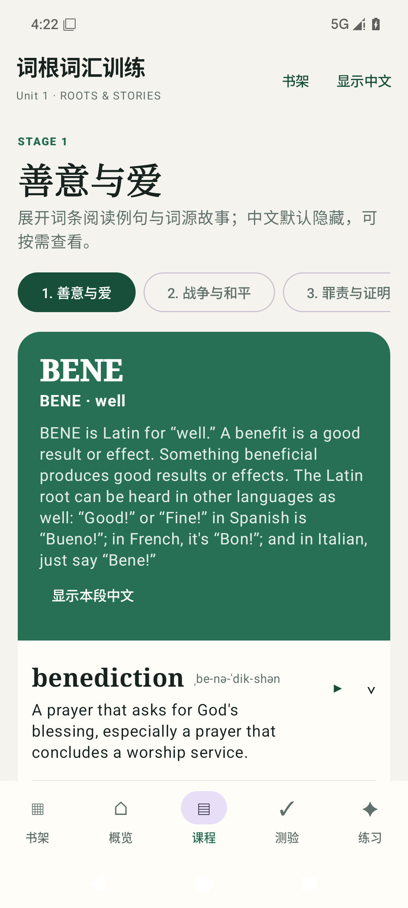

> **图 4　数据驱动的五阶段课程。** 阶段标题、词根顺序、关联测验和色彩索引都来自单元 payload；新增单元不需要复制一套界面逻辑。

这是一项关键架构选择。Unit 1 时，课程阶段很容易被写成 Kotlin 常量；Unit 2 的到来迫使系统把阶段定义迁移进内容模型，从而让后续二十八个单元成为数据扩展，而非功能分叉。

---

# 4. 学习体验与交互闭环

## 4.1 双语渐进展开：让中文成为脚手架

| 英文详情、词源故事与 TTS | 展开本词全部中文 |
| --- | --- |
| 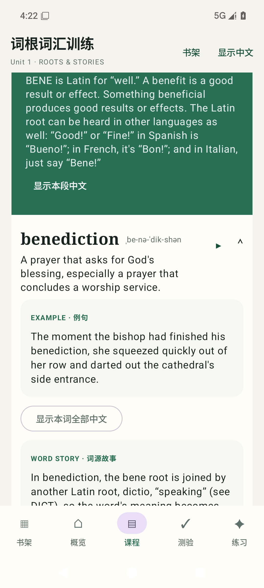 | 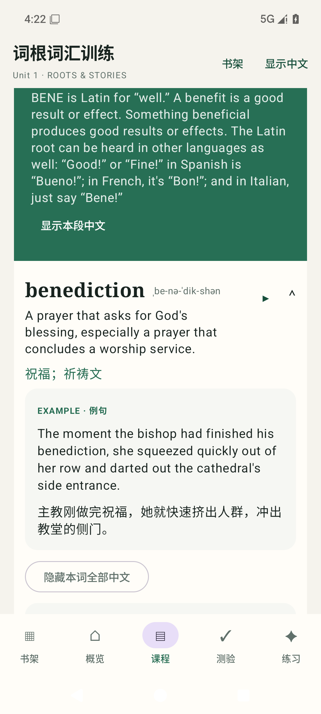 |
| **图 5**　词条展示发音、英文释义、例句、词源故事与系统 TTS。 | **图 6**　学习者可只展开当前词条的释义、例句和故事中文，不必切换全局状态。 |

“默认隐藏、按需展开”的意义不仅是界面简洁。它建立了一种学习节奏：先尝试用英文理解，再在认知负荷过高时调用中文；中文揭示可以精确到词根段落或单个词条，不会破坏其他内容的英语沉浸。

## 4.2 固定测验：忠实保留题目，同时提供现代反馈

| 答题前 | 错误提交后的可解释反馈 |
| --- | --- |
| 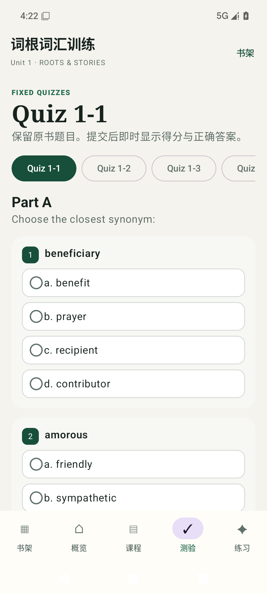 | 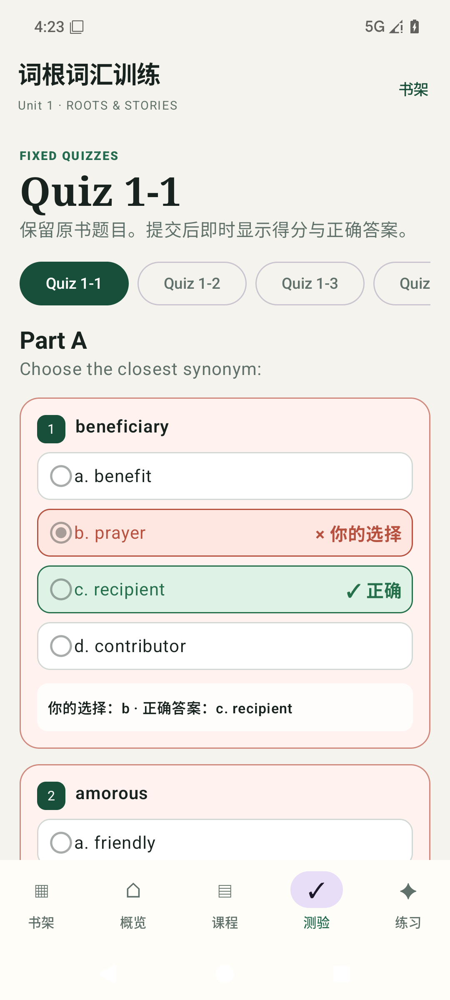 |
| **图 7**　固定题目的单选形态，提交前不泄露答案。 | **图 8**　错误项标红、正确项标绿，并明确呈现用户选择与正确答案。 |

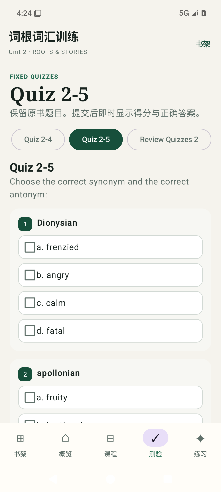

> **图 9　Unit 2 的双答案题。** 数据模型支持一个答案或恰好两个不同答案；界面相应从 radio 切换为 checkbox，而不是把题目粗暴改写成单选。

固定测验严格保留来源题干与选项，但反馈体验由应用增强：即时得分、选项颜色、逐题答案与最佳成绩本地保存。这里的原则是“内容忠实，交互现代”。

## 4.3 四种动态练习：从记忆到迁移

| 释义识别 | 正确反馈 |
| --- | --- |
| 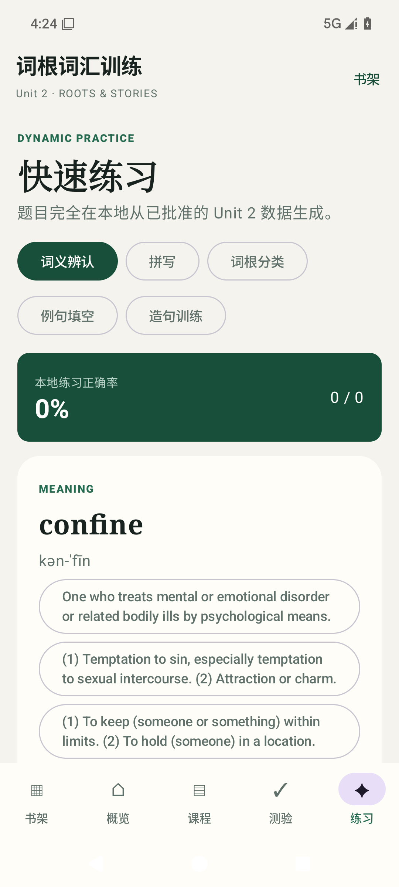 | 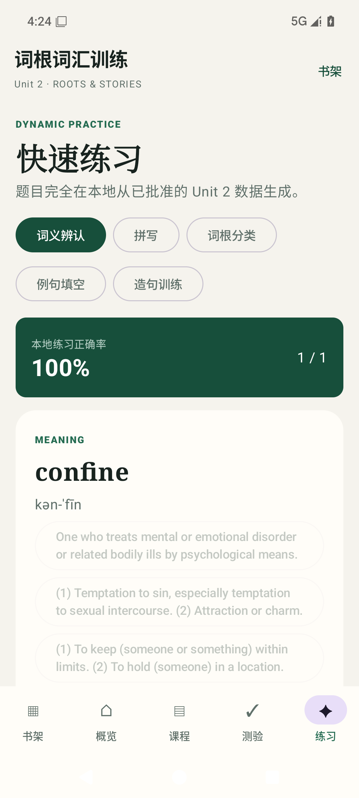 |
| **图 10**　从本地单元内容即时生成释义选择题。 | **图 11**　结果、正确率和累计进度立即反馈。 |

| 拼写 | 词根分类 |
| --- | --- |
| 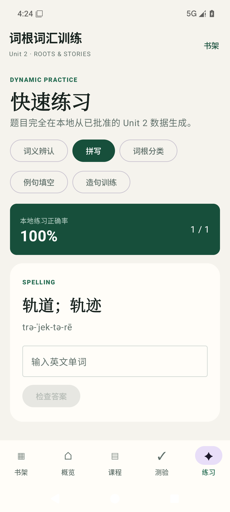 | 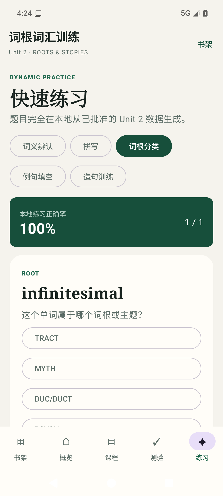 |
| **图 12**　结合中文提示与音标进行主动拼写。 | **图 13**　把词条重新映射到词根类别，强化构词关系。 |

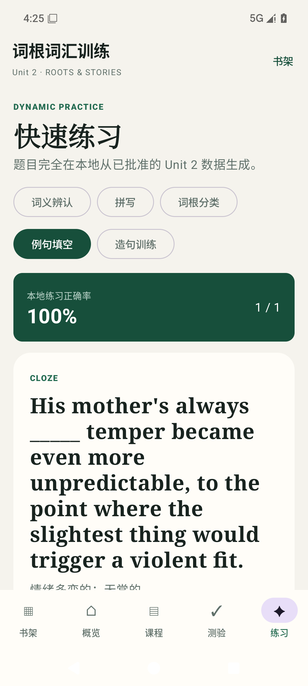

> **图 14　例句填空。** 题目直接从批准的真实例句生成，使词汇从孤立释义返回语境。

四种模式对应不同记忆通路：识别、主动回忆、结构分类与语境恢复。它们不依赖远端题库，也不会生成脱离已审核内容的随机知识。

## 4.4 三句写作工坊：透明检查与外部智能之间的边界

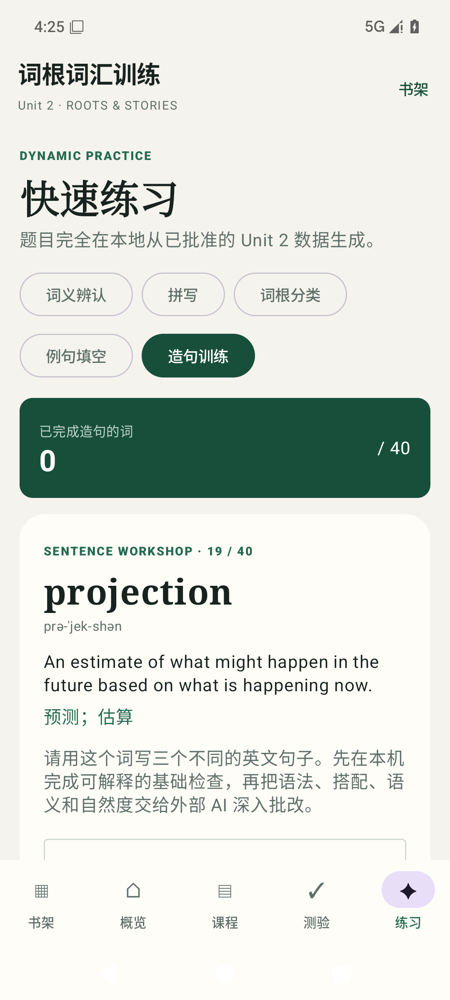

> **图 15　三句写作任务。** 每个词要求学习者写三个不同的原创句子，目标从“知道词义”提升到“能主动使用”。

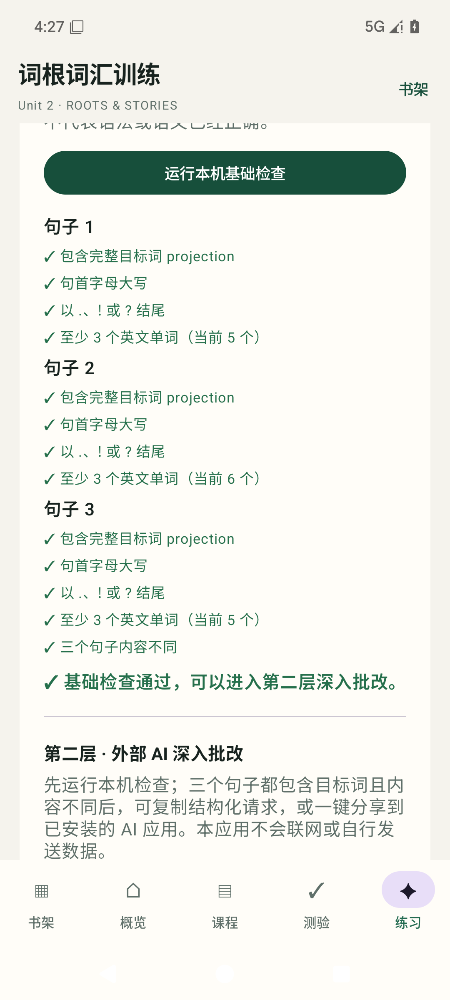

> **图 16　可解释的本机检查。** 应用逐句检查完整目标词、首字母大写、句末标点、最低英文词数与三句互异。它只声称检查机械条件，不伪装成语法或语义模型。

| 外部评审控件 | 结构化请求复制完成 |
| --- | --- |
| 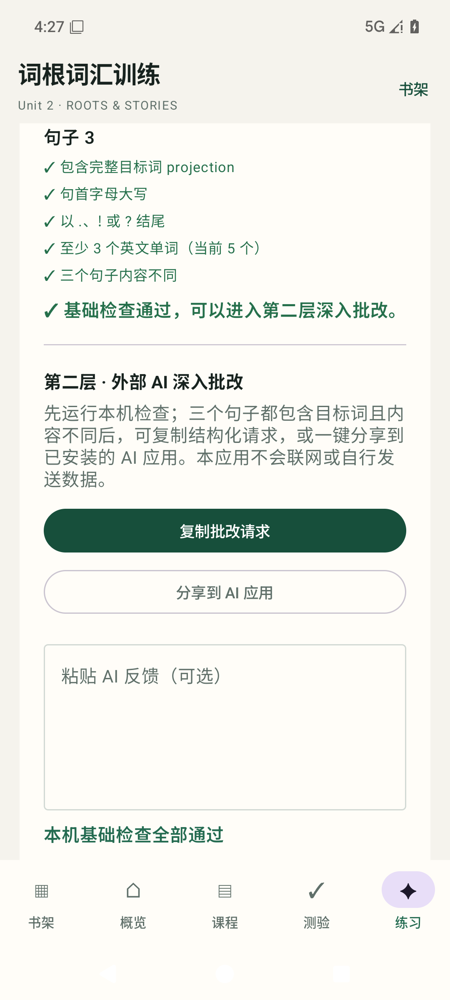 | 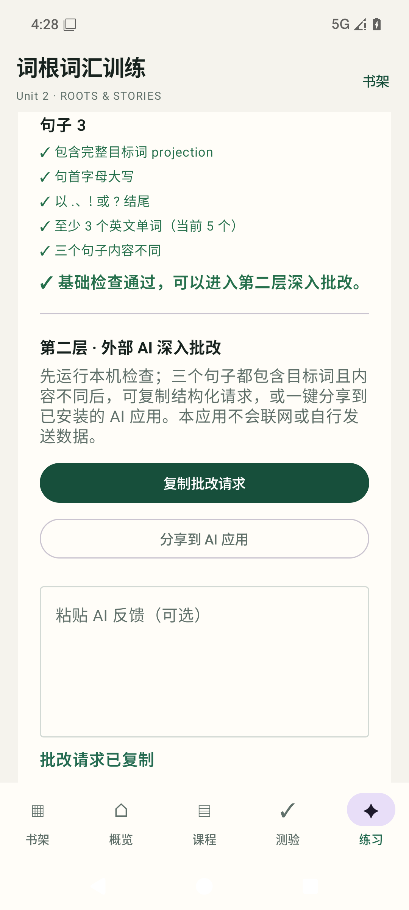 |
| **图 17**　本机检查通过后，复制与系统分享入口才启用。 | **图 18**　应用只把结构化请求交给用户，不自行联网或发送数据。 |

这一设计解决了一个容易被夸大的问题：简单规则不能判断自然度，大模型也不应被偷偷嵌入离线应用。系统因此采用两层责任模型：第一层透明、确定、可离线；第二层可选、外部、由用户主动触发。

## 4.5 真实反馈回填：形成完整写作循环

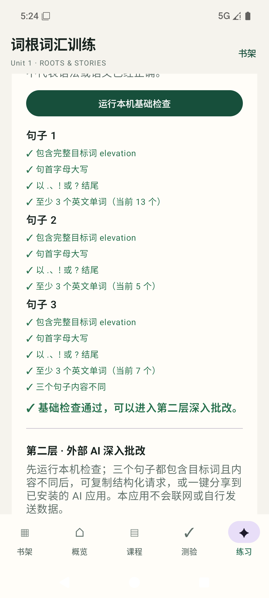

> **图 19　真实写作案例的本机门槛。** 三句全部满足形式要求后才进入深入评审。

| 外部反馈：句子 1 | 外部反馈：句子 2 |
| --- | --- |
| 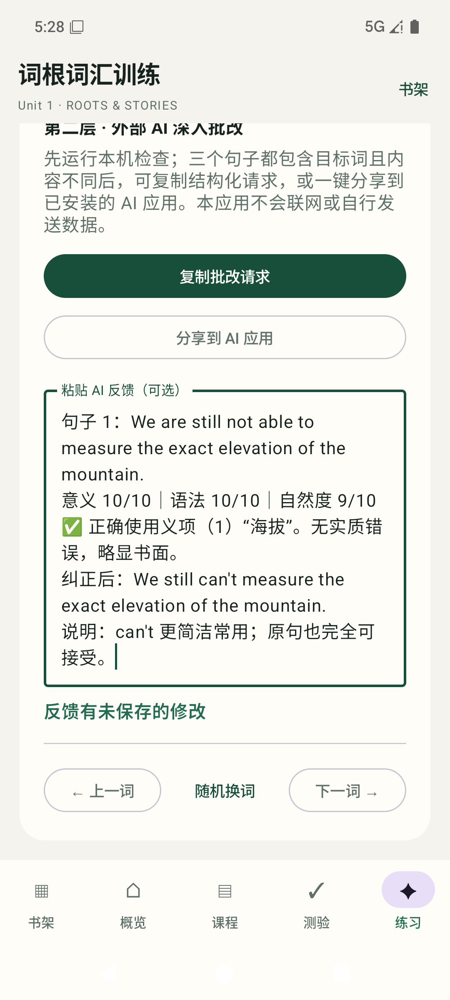 | 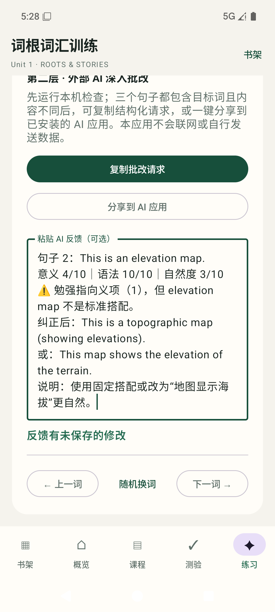 |
| **图 20**　义项、语法、自然度与改写建议被保存回本地反馈区。 | **图 21**　反馈能指出搭配问题，并给出保留目标词的修改路径。 |

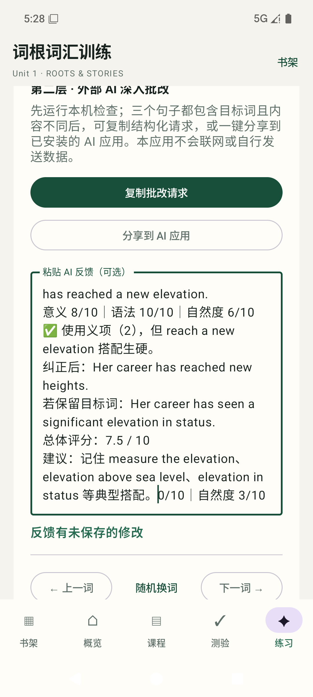

> **图 22　句子 3 与总体评估。** 外部反馈重新回到学习系统，成为可持续复习的本地材料，而不是一次性聊天记录。

---

# 5. 系统架构与本地状态

## 5.1 端到端架构

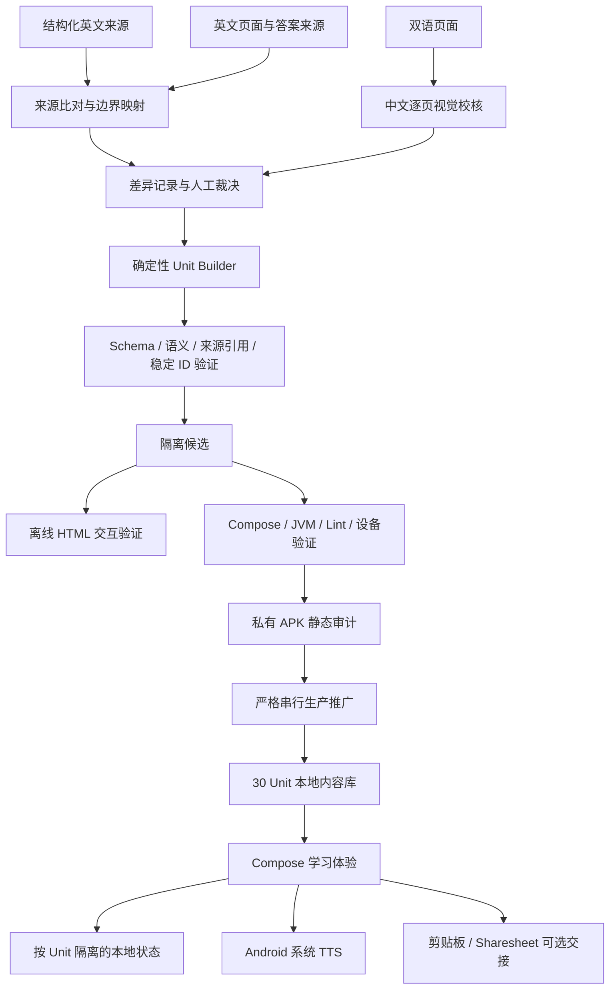
```mermaid
flowchart TB
    E[结构化英文来源] --> R[来源比对与边界映射]
    P[英文页面与答案来源] --> R
    Z[双语页面] --> H[中文逐页视觉校核]
    R --> D[差异记录与人工裁决]
    H --> D
    D --> B[确定性 Unit Builder]
    B --> V[Schema / 语义 / 来源引用 / 稳定 ID 验证]
    V --> C[隔离候选]
    C --> W[离线 HTML 交互验证]
    C --> A[Compose / JVM / Lint / 设备验证]
    A --> K[私有 APK 静态审计]
    K --> S[严格串行生产推广]
    S --> L[30 Unit 本地内容库]
    L --> UI[Compose 学习体验]
    UI --> PS[按 Unit 隔离的本地状态]
    UI --> TTS[Android 系统 TTS]
    UI --> X[剪贴板 / Sharesheet 可选交接]
```

## 5.2 内容模型

生产内容由一个有序 catalog 与三十个 Unit payload 构成。每个 Unit 包含：

- `unit_id` 与本地化标题；
- roots 与可选 thematic sections；
- 每组的 introduction、meaning、words 和来源引用；
- 五个 `course_stages`；
- 六组固定与复习测验；
- 单元级审核状态与内容版本。

稳定 ID 是整个系统的脊柱。进度不依赖数组位置、文件名或内容版本，因此添加后续单元不会让先前学习状态漂移。

## 5.3 本地状态隔离与恢复

| Unit 进度隔离 | 强制停止后恢复 Unit 2 |
| --- | --- |
| 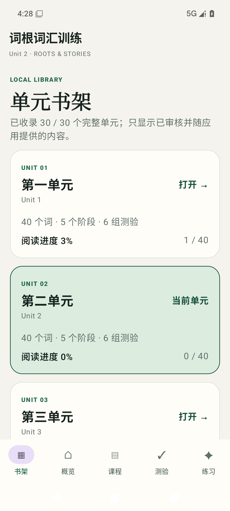 | 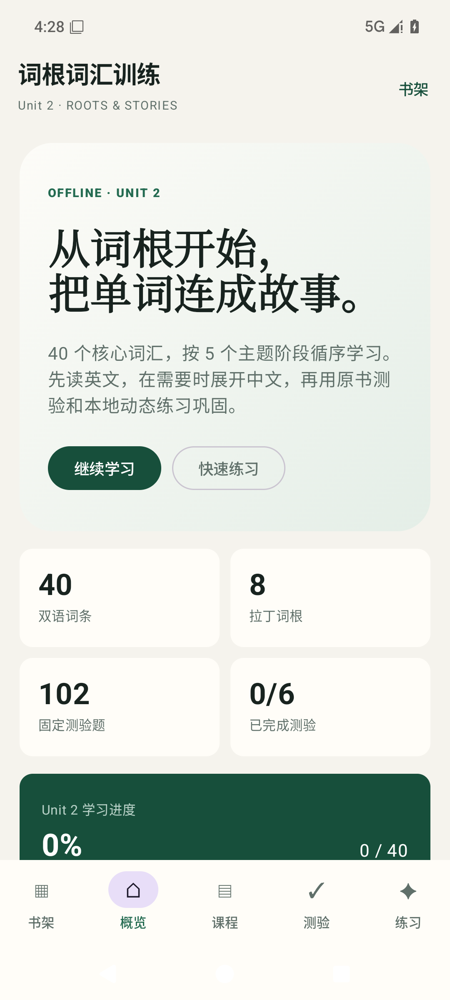 |
| **图 23**　Unit 1 与 Unit 2 的词条进度独立，当前单元身份清晰。 | **图 24**　应用被强制停止后仍恢复最后访问的 Unit 2，且继续保持离线状态。 |

Android 为每个 Unit 使用稳定 preference ownership；应用级状态单独保存最后访问单元。Unit 1 从早期 content-version storage 向稳定存储迁移时采用同步、幂等合并：保留成绩、计数、草稿与反馈，不删除旧数据，也不让重复迁移放大计数。

## 5.4 Offline-first 不是一句口号

- APK 构建时打包全部批准内容；运行时不下载教材数据。
- 应用不申请网络权限。
- 没有账户、分析、广告、云同步或网络客户端。
- Android backup 被关闭，学习数据不自动进入云端或设备迁移备份。
- TTS 使用操作系统能力。
- 动态练习全部由本地批准内容生成。
- 外部 AI 评审只通过用户主动复制或系统分享完成。

---

# 6. 内容工程与双语校核

## 6.1 为什么 OCR 不够

双语 PDF 的文本层可以提高定位速度，却存在断词、错字、栏目错序、跨页拼接和语义替换。项目因此要求每一段最终中文、音标、答案与结构边界都对照渲染页面核查。自动化可以证明“字段有值”，却不能证明“翻译正确”。

## 6.2 来源优先级

1. 结构化英文来源负责 canonical 英文；
2. 英文 PDF 负责版式、边界、测验与答案交叉核验；
3. 双语 PDF 负责中文与双语版面；
4. 来源不一致时进入显式 discrepancy record，不静默猜测。

## 6.3 四类代表性裁决

| 类型 | 代表问题 | 处理原则 |
| --- | --- | --- |
| 形态与数 | 英文复数结构在双语排印中发生不一致 | 保留 canonical English，记录规范化理由 |
| 地名错配 | 英文地名与中文地名指向不同地点 | 不掩盖冲突；保留来源并在 provenance 中明确标识 |
| 专业语义错误 | 音乐和弦音名、大小调类别错配 | 暂停生产，由用户批准后按 canonical English 修正中文 |
| 整段替换 | 双语例句与 canonical English 讨论完全不同事件 | 保留 canonical English，重新提供对齐中文 |

这类裁决揭示了内容工程与普通 ETL 的区别：错误不是缺失值，而是看似流畅、实则错误的语义。它必须由来源比较、领域判断和显式授权共同解决。

## 6.4 Schema 的谨慎演进

真实词汇迫使 headword 规则逐步支持三词短语、首字母大写的专名、带撇号的复合形式和带重音符号的拉丁字符。每次扩展都遵循“最窄可用规则”：只容纳已验证的 canonical 形式，不顺便允许任意标点、混合大小写或非法空格。

---

# 7. 从 Unit 1 到 Unit 30 的工程演进

## 7.1 Unit 1：以关卡代替豪赌

Unit 1 采用六个明确停止点：

1. 工具链和工作空间初始化；
2. 小批双语样本；
3. 完整 Unit 1 数据；
4. 本地 HTML 交互预览；
5. 原生 Compose 预览；
6. 私有 APK 构建与安装验证。

这一顺序避免了最常见的失败：在内容仍不可信时就投入大量移动端开发。样本先验证来源优先级与翻译策略；完整数据获准后才讨论交互；HTML 通过后才把体验迁移到 Compose；Compose 通过后才生成 APK。

## 7.2 Unit 2：第二个单元迫使架构成熟

Unit 2 带来了 catalog、书架、数据驱动课程、双答案题、稳定身份、按 Unit 隔离的持久状态和旧进度迁移。它是“更多内容”与“真正多单元产品”之间的分水岭。

## 7.3 Unit 3：Human-in-the-loop Pilot

Unit 3 首次把来源核验、候选构建、HTML、Android、APK 审计串成 A1–A5 的一次连续试运行，并在 A6 做正式复盘。自动化从未声称代替人工视觉审查；它只验证 hash、结构、覆盖、可复现性和门禁顺序。

## 7.4 Unit 4–30：并行生产，串行真相

后续二十七个 Unit 采用独立任务和独立工作区。最多三个候选同时执行来源审查与内容构建，但 Android 设备验证只有一条独占通道，生产推广也只有一条独占通道。

候选可以乱序完成，生产只能按 Unit 4、5、6……30 顺序前进。这个设计同时获得吞吐和一致性：慢 Unit 不阻止其他候选准备，却绝不能被后来的 Unit 绕过成为生产内容。

---

# 8. 自动化门禁、并发与串行推广

## 8.1 A0–A6

| 阶段 | 目标 | 核心证据 |
| --- | --- | --- |
| A0 | 建立控制面与规则 | 授权、范围、稳定 ID、候选隔离、失败恢复 |
| A1 | 来源审核 | 精确范围、英文比较、中文逐页视觉校核、答案与差异 |
| A2 | 内容候选 | 确定性构建、schema、语义、来源引用、专项与全量测试 |
| A3 | 交互候选 | 稀疏 staging catalog、自包含离线 HTML |
| A4 | 原生应用验证 | JVM、Lint、Compose、设备交互 |
| A5 | 私有 APK 审计 | 权限、备份、依赖、资产、身份、大小、安装、冷启动 |
| A6 | 复盘 | false positive/negative、证据缺陷、恢复和批次改进 |

## 8.2 状态机

```text
planned → running → candidate_ready → android_running
        → verified → promotion_running → promoted

任一运行态 → blocked / failed → 记录原因与检查点 → 隔离环境恢复
```

## 8.3 推广事务

推广之前，系统要求候选能够从审核输入重新构建，并与已接受内容字节一致；随后验证来源映射、稳定 ID 与 catalog 基线。新 payload 先进入不可见位置，catalog 最后替换。替换后仍只能标为“等待回归”，必须通过完整内容、工具、HTML、Android、设备和 APK 检查，才能宣布推广完成。

如果回归失败，系统先恢复 catalog，使错误内容立即不可见，再恢复候选状态。恢复不能通过手改生成文件或放松 validator 完成。

---

# 9. 测试金字塔与 APK 审计

## 9.1 五层证据

| 层级 | 验证对象 | 不能替代什么 |
| --- | --- | --- |
| 内容/schema | IDs、阶段引用、问题、答案、来源、catalog | 不能证明中文语义正确 |
| Python 工具 | builders、门禁、rollback、HTML、审计逻辑 | 不能证明 Android 真实交互 |
| JVM | repository、学习引擎、迁移、状态隔离 | 不能证明 Compose 布局与系统集成 |
| 设备 | 书架、单元切换、单双答案、恢复、滚动 | 不能证明来源页面已人工读过 |
| 人工视觉 | 英中页面、跨页结构、来源冲突 | 不能证明 APK 权限和资产边界 |

只有五层同时成立，才能形成完整证据闭环。

## 9.2 APK 静态审计

每次关键构建检查：

- 无网络权限；
- backup 与设备迁移均关闭；
- 不含账户、分析、广告、云同步、网络客户端或生成式 AI SDK；
- 只打包 catalog 与批准 Unit payload；
- 不打包原始书籍、审核记录、样本、测试或 schema；
- package、版本和最低系统符合产品边界；
- 安装、冷启动与设备回归通过；
- 资产体积增长能被新增内容合理解释。

## 9.3 最终验证

最终生产库重新执行了完整内容与工具回归、代码风格检查、catalog validation、Android JVM、Lint、构建与五项设备测试。报告制作期间又在真实私有项目环境中独立重跑，193 项回归全部通过。

---

# 10. 失败、恢复与关键教训

## 10.1 Schema 误拒真实内容

Unit 3 pilot 中，早期规则只允许短 headword，真实三词词条被拒绝。系统在 A2 停止；经明确批准后只扩展必要形式，并加入回归测试。这是一例有价值的“安全型假阳性”：门禁阻止了进度，但也防止代理静默改变 canonical 内容。

## 10.2 环境失败不是产品失败

Gradle cache、sandbox 权限、独立工作区缺失本地 ignored 来源等问题曾阻止测试。正确恢复方式是记录环境条件、映射合法来源、切换到干净可写 workspace 并重跑受影响门禁，而不是将失败解释成“测试大概没问题”。

## 10.3 任务身份与可见性

批处理过程中，内部子任务一度被误认为正式 Unit 根任务；用户通过界面观察指出任务实际上未启动。系统随后创建可见、独立、可核验的根任务并停止重复写入。教训是：任务存在性必须绑定外部可见 ID、工作区、状态与制品，不能只来自代理自述。

## 10.4 不可信旧草稿必须整体否决

后期多个 Unit 的旧草稿包含词数错误、测验缩减、异常答案分布、损坏音标、占位题或错误页码。项目没有“补几项让 validator 通过”，而是回到真实来源完整重建。

## 10.5 Schema 与运行时消费者错位

部分 Unit 没有 thematic section。Schema 允许数量为零，但 Android repository 最初仍假设字段存在。设备验证暴露后，契约被明确为“字段必须存在，可以是空数组”。这说明合法 JSON 不等于所有消费者都正确处理；端到端验证不可省略。

---

# 11. 成果、限制与维护建议

## 11.1 成果

- 从四份异构书籍来源建立三十 Unit 的可信双语内容库；
- 形成结构化、可验证、可重复构建的内容生产线；
- 完成离线 Compose 学习应用与完整交互闭环；
- 建立稳定本地状态、旧进度迁移与跨 Unit 隔离；
- 将人工视觉审核、自动化门禁、设备验证和私有 APK 审计结合；
- 在二十七个 Unit 的批处理上验证“候选并行、生产串行”的控制架构。

## 11.2 限制

- 设备验证主要集中在一台 Android 16 模拟器，尚未形成覆盖多个厂商、屏幕与最低系统的广泛矩阵；
- 自动化不能证明翻译绝对无误，人工视觉核查仍是不可替代的质量成本；
- 尚未进行完整无障碍、长期性能、功耗和进程异常恢复专项评估；
- 本地学习进度没有导入导出与加密备份，这是私人离线边界的取舍；
- 写作工坊的本机规则只检查形式，不判断语法、语义、搭配或自然度；
- 完整内容受版权边界约束，无法通过公开众包获得无限审查。

## 11.3 维护建议

1. 建立 API 26、代表性中间版本与最新系统的设备矩阵。
2. 增加字体放大、横竖屏、深色模式、无障碍朗读与进程死亡恢复测试。
3. 为每个 Unit 保留机器可读的逐页 checklist 与二次抽样审阅记录。
4. 把命令、输入、输出、环境和日志绑定成内容寻址 evidence bundle。
5. 为状态迁移增加 property-based tests 与损坏数据恢复测试。
6. 定期进行依赖、许可证、权限和 APK 资产复审。

---

# 12. 对现行 Agentic Coding 的思考

## 12.1 长期上下文：不是窗口越长越可靠

这个项目跨越初始化、六个 Unit 1 Gate、Unit 2 迁移、Unit 3 pilot、批处理架构、二十七个候选任务、串行设备验证和生产推广。长上下文能容纳更多文字，却不能自动区分历史禁令与后续授权、候选完成与生产完成、内部子任务与正式根任务。

真正需要的是事件溯源式项目记忆：授权、状态转换、命令、制品、人工裁决与失败恢复分别建模，并可按因果关系查询。

## 12.2 授权与控制面漂移

目标不等于权限，架构批准不等于内容批处理授权，Unit 接受不等于允许发布。自然语言容易让这些边界在长任务中漂移。

未来系统应把授权编译为机器可读 capability：包括 scope、允许动作、基线、禁止项、有效期、升级条件与撤销语义。工具调用应自动携带并验证授权，而不是要求模型反复回忆 prompt。

## 12.3 并发代理：吞吐背后的协调税

三个候选并行不等于三倍速度。模拟器、构建输出、catalog、ignored 来源文件和状态 ledger 都是共享资源。并发需要 lease、heartbeat、single-writer、dead-task recovery 和原生资源调度。

本项目最有效的原则是：**让探索并行，让真相串行。**

## 12.4 证据真实性

Agent 很容易把“调用过命令”“看到过成功字样”“已有文件”压缩成“通过”。可信系统必须建立 claim–evidence graph：每个结论链接到命令、输入状态、退出码、输出制品、环境、日志和 reviewer attestation。没有证据链接的结论应被标为未验证。

## 12.5 GUI、沙箱与本地工具链的不稳定

浏览器登录、模拟器状态、Gradle cache、文件权限和本地 ignored 来源都可能使同一命令在不同任务中呈现不同结果。平台需要在执行前声明和预检能力，并结构化区分产品缺陷、环境缺陷、权限缺陷与编排缺陷。

## 12.6 代码审查与内容审查是两门专业

代码检查能发现 ID 冲突、路径逃逸、迁移重复和资产泄漏，却发现不了语义错译；语言审阅者能发现翻译问题，却未必能识别 backup 配置或权限风险。组织应建立 software assurance 与 editorial assurance 双轨评审。

## 12.7 人类监督不是一个“批准”按钮

用户需要判断来源冲突、schema 影响、版权边界、任务状态和不可逆操作。优秀的 Agentic Coding 系统应节省而不是消耗人类注意力：只升级 material ambiguity，提供最小充分证据，把 routine pass 汇总，把范围扩张与不可逆操作突出。

## 12.8 成本与时延

逐页审核、全量回归、设备 lane 与串行推广都昂贵。优化不能简单等于少跑测试。合理方向是 provenance-aware test selection：内容变化触发内容与来源验证，共享 loader 变化触发全库与设备矩阵，生产推广始终保留完整端到端回归。

## 12.9 可复现性

如果复现依赖“某个 agent 记得怎么做”，就不是真正可复现。需要的是受控 source mount、确定性 builder、环境锁定、命令 DAG、expected artifacts 和不可变 evidence capsule。受版权来源可以不进入 capsule，但必须用合法恢复说明与密码学承诺固定身份。

## 12.10 组织采用门槛

组织采用 Agentic Coding 需要的不只是模型预算，还包括：

- 清晰的授权、版权和数据分类政策；
- 任务身份、secret、artifact 与审计基础设施；
- 能承受并发代理的 CI、设备与缓存资源；
- 独立审查 agent 产出的专业能力；
- 接受 fail-closed 暂停和人工裁决的组织文化；
- 衡量返工、证据完整度、人工注意力与漏出缺陷，而不是代码行数。

## 12.11 TRACE 改进框架

| 层 | 含义 | 最低要求 |
| --- | --- | --- |
| **T — Typed Authorization** | 类型化授权 | scope、action、baseline、prohibition 机器可读 |
| **R — Reproducible Artifacts** | 可复现制品 | 确定性构建、稳定 ID、环境锁定、来源承诺 |
| **A — Auditable Agents** | 可审计代理 | task、workspace、state、artifact 与证据一一绑定 |
| **C — Controlled Concurrency** | 受控并发 | single-writer、资源 lease、串行推广、显式回滚 |
| **E — Expert Human Review** | 专家人工复核 | material ambiguity 升级、双轨审查、review attestation |

## 12.12 未来研究方向

1. 把自然语言授权编译为可验证时序策略。
2. 为多代理 task state 与共享资源提供形式化一致性保证。
3. 训练模型明确区分 observation、inference、authorization 与 correction。
4. 建立视觉页面 attestation、OCR diff 与人工裁决的组合证据。
5. 研究隐私保持的内容复现，使外部审计无需暴露完整版权材料。
6. 让 GUI agent 产生可回放、可校验的 action trace。
7. 从聊天摘要升级为 event-sourced long-term project memory。

---

# 13. 结语

这个项目的完成，不只是手机里多了一个可用应用。它证明了一个更艰难的命题：当输入是异构的、双语的、受版权约束的内容，当生产由人类与多个代理共同完成，当任何一个“看起来没问题”的错译都可能进入三十个单元的规模化流水线时，工程必须超越生成代码。

真正可靠的系统需要知道：谁授权了什么，哪份来源拥有哪一字段的优先级，哪些判断由机器完成，哪些必须由人类承担，失败停在哪里，恢复从哪里开始，以及每一次“完成”究竟由什么证据支撑。

“词根词汇训练”的价值正在这里：

> 它把 1,200 个词条变成一套学习系统；
> 把三十个单元变成一条可审计生产线；
> 也把 Agentic Coding 从“会写代码”推向了“必须对证据、边界和后果负责”。

---

## 图版说明

本报告共使用 24 张真实 Android 模拟器截图。所有截图均来自完整私有 APK 的实际操作状态，原始分辨率一致，未裁切、未拼接、未修图。TTS 声音、系统 Sharesheet、无网络权限和 APK 资产边界无法仅由静态 PNG 完整表达，相关结论由运行时与静态验证共同支撑。
